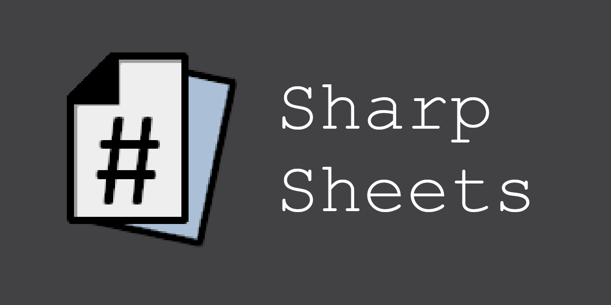

# SharpSheets

Welcome to SharpSheets, a program for creating PDF documents for all your gaming needs. SharpSheets will enable you to create form-fillable PDF documents from text-based configuration files, allowing easy customisation and sharing of your creations. You will be able to create character sheets, card sets, and other game aids, using the many features SharpSheets offers for specifying the look and layout of your documents.

(Currently SharpSheets is only available for Windows, but hopefully that will change in the future!)

## Download

You can download SharpEditor (a text editor for the SharpSheets library) from our [Releases](https://github.com/gebodal/SharpSheets/releases) page.

Simply download and unpack the .zip file, and run the SharpEditor executable, and you're good to go!

## Documentation

The documentation for SharpSheets can be found in the program `Help` menu (or press the `F1` key when the program opens).

## License

SharpSheets, SharpEditor, and GeboPDF are free software, licensed under the [GNU GPLv3](LICENCE).

## Support SharpSheets

If you'd like to, you can:

(Especially if you're using SharpSheets to produce materials for your commercial product!)

## Feedback

If you have any feedback, have a question, or have found a bug, please [file an issue](https://github.com/gebodal/SharpSheets/issues) to let us know.

## Acknowledgements

SharpSheets makes use of some other free software from the .NET community, and we would like to thank the following:

* [`dotnet/wpf`](https://github.com/dotnet/wpf) (MIT license)
* [`icsharpcode/AvalonEdit`](https://github.com/icsharpcode/AvalonEdit) (MIT license)
* [`SixLabors/ImageSharp`](https://github.com/SixLabors/ImageSharp) (used here under the Apache License 2.0)

And of course the dotnet team for their work on C# itself.

We have also made use of the following open source projects, and would like to thank those creators for their work:

* [`feathericons/feather`](https://github.com/feathericons/feather) (MIT license)
* [`Remix-Design/RemixIcon`](https://github.com/Remix-Design/RemixIcon) (Apache License 2.0)
